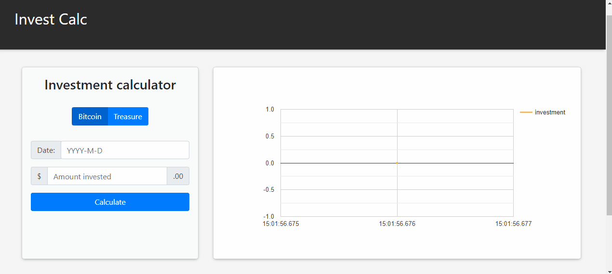

Access the application [Invest Calc](https://invest-calc.netlify.app/).

## INVEST CALC

Welcome to invest calc, an investment calculator straight to the point.

## TECHNOLOGIES

This project was developed with the purpose of studying the following technologies:
1. React + Typescript: Development framework.
2. Axios: To make external calls to APIs. In this project I used the cryptocurrency API [cryptocompare](https://min-api.cryptocompare.com/).
3. react-google-charts: Used for rendering interactive charts.
4. React Bootstrap: Framework for developing front-end components in their version for react.

### USABILITY

1. Choose a type of investment, Treasure or Bitcoin.
2. Mark the date of your investment
3. Fill in the amount invested
4. Click calculate

Ready! The result of your investment will be drawn on the chart.

### :memo: LICENSE

The project can be copied and modified, as long as due credit is given.

